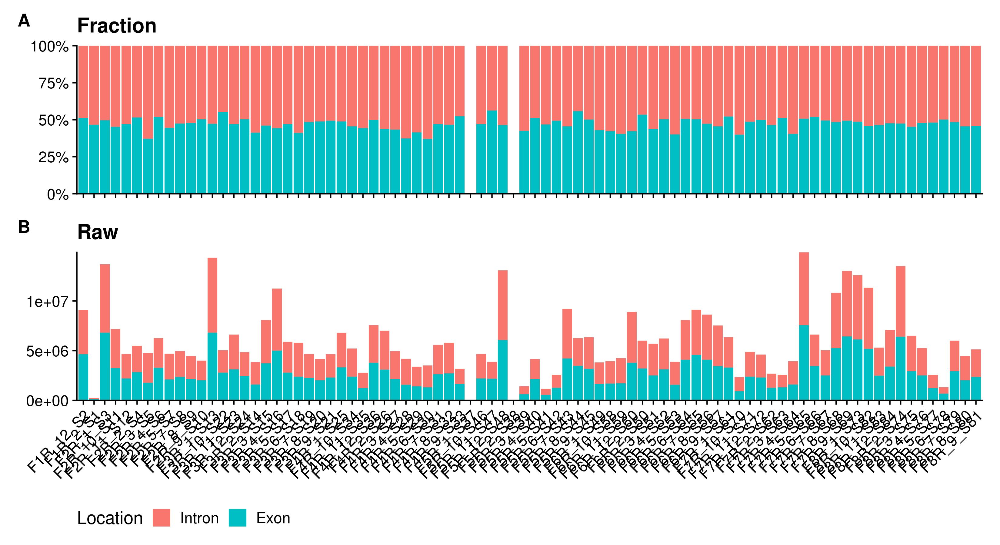
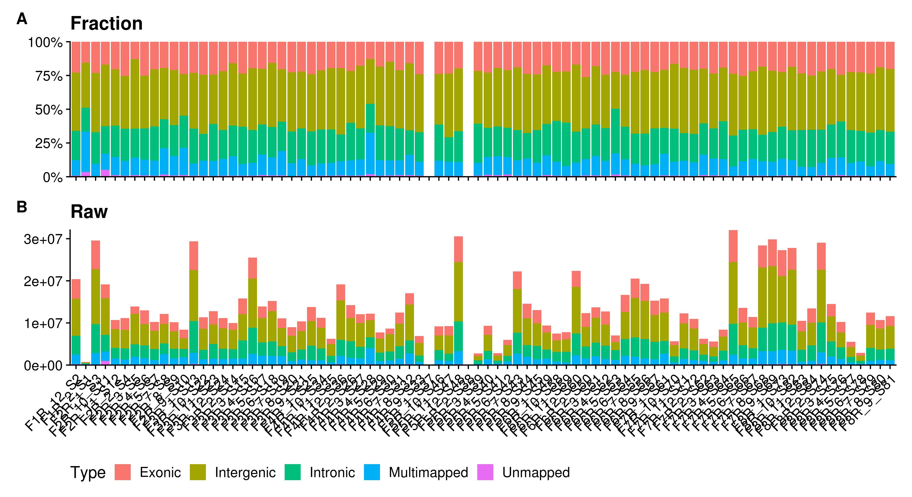

# Running the Pipeline
Jordan Sicherman, Sonny Chen, Justin Chee\
May 17, 2020

# Introduction
Here we walk through the workflow of our bioinformatics pipeline. We start with raw FASTQ files, align them to reference genomes, process and quantify these reads, and finally produce count tables from this dataset. Examples of basic analysis and visualization of the data will also be given.

# QC
It is common to perform quality assessment on raw sequencing reads. This can be performed automatically by running:

`./qc.sh -i input-directory -o output-directory`

For this project, our FASTQ files are located in `/example/fastq/`. We'll run this command first and check out the score report before continuing with the analysis. It is worth noting that this script generates individual [FastQC](https://www.bioinformatics.babraham.ac.uk/projects/fastqc/) reports for every FASTQ file in the specified input directory _as well as_ a [MultiQC](https://multiqc.info/) report summarizing all the samples.

`./qc.sh -i /example/fastq/ -o /example/fastqc/`

FastQC reports will be generated in parallel using Slurm. You should open the MultiQC report and inspect base quality scores, adapter content and etc. to ensure samples are of sufficient quality before moving on.

# Alignment
We use STAR to perform alignment to a reference genome. STAR aligns the raw reads (FASTQ format) to a reference genome and here we also remove PCR duplicates. Alignments are done in parallel by first generating a set of shell scripts that will be sequentially executed by Slurm.

`./align.sh [-g [human|mouse]] [-p] [-n nodes] [-t threads] -i input-directory -o output-directory`

| Flag | Description | Default |
| ---- | ----------- | ------- |
| g | Select the genome to align to. The specific reference genome used is either hg38_ensembl (human) or mm10_ensembl (mouse). | human |
| p | Whether or not to samples are paired-end. | false |
| n | How many nodes to distribute the job over. | 4 |
| t | How many threads to run STAR with. | 10 |
| i | The path where your input (fastq or fastq.gz) files are. | |
| o | The path where your output files will be sent. Will be created if it doesn't exist. | |

In my case, FASTQ files are from a paired-end sequencing run from 84 postmortem mouse brain samples and are located in `/example/fastq/`. STAR results will be output to `/example/` and will be permitted to run on 12 threads for speeding up the process.

`./align.sh -g mouse -p -t 12 -i /example/fastq -o /example`

After generating all files, Slurm will allocate some nodes and begin running the alignments in parallel. This step will take some time (24 hours or longer), but once complete, your file structure will look like the following:
```bash
/example/
|-- tasks.sh
|-- fastq
|-- logs
|-- scripts
`-- bam
    |-- raw
    `-- processed
```
# Merging
In some cases, you may have many FASTQ files for one sample (ie. if the sample spanned multiple lanes). These can be merged simply using samtools after alignment to ensure that the count matrices generated later have only one column per sample. We will merge our processed BAM files (genome-aligned and PCR duplicates removed) again using 12 threads and outputting results into `bam_merged/processed`.

`./merge.sh -t 12 -i /example/bam/processed -o /example/bam_merged/processed`

# Quantification
With the reads aligned to a reference genome, we can now quantify reads aligning to genomic regions.

## Reference Building
A genomic reference is used at this point, which is built for you automatically. However, if you want to generate it manually or regenerate it for some reason, you may do so using the following command (for example, for mouse):

`Rscript buildReference.R mouse`

References will be placed in a reference folder in the pipeline directory. Your pipeline should look like the following:
```bash
/Quant.ie/
|-- README.md
|-- docs
`-- references
    |-- mouse.Rdata
    `-- human.Rdata
|-- src
```
## Generating Counts
Count matrices are commonly used in genomic analyses. This pipeline generates a matrix for reads aligning to exonic regions and intronic regions separately, which may be useful in downstream analysis. Generating these matrices is done with the following command:

`Rscript quantify.R <human|mouse> <paired> <input directory> [output directory] [cores]`

| Parameter | Description | Default |
| --------- | ----------- | ------- |
| 1 | What taxon you're interested in | |
| 2 | Whether or not your sample was paired | |
| 3 | The directory containing your BAM files | |
| 4 | The path to where you want your output. Should usually be the same as the output directory from `align.sh`. | Same as input directory |
| 5 | How many cores to use while doing quantification | 5 |

To generate count matrices for our mouse sample, we simply execute:

`Rscript quantify.R mouse true /example/bam_merged/processed /example`

Once completed, you should have the following directory tree:

```bash
/example/
|-- tasks.sh
|-- fastq
|-- logs
|-- scripts
|-- bam
    |-- raw
    `-- processed
|-- bam_merged
    |-- processed
`-- quantified
    |-- counts_exon.rds
    |-- counts_intron.rds
    |-- fpkm_exon.rds
    |-- fpkm_intron.rds
    `-- qc.tsv
```
# Visualization
Count matrices can be used to visualize basic quality metrics such as number of reads that aligned and what genomic regions they aligned to. Some helpful figures can be generated using the following command:

`Rscript visualize.R <directory>`

The directory provided should be the base directory of your project since it uses information from the STAR logs as well. To generate such visualizations, simply execute:

`Rscript visualize.R /example/`

The following figures will be generated:


A distribution of reads aligning to introns and exons per sample.


A complete mapping distribution of reads per sample


Quality metrics, including fraction of reads aligning to mitochondrial and rRNA.